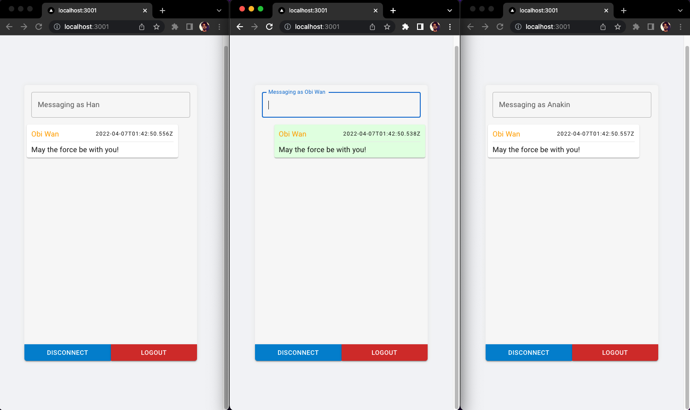
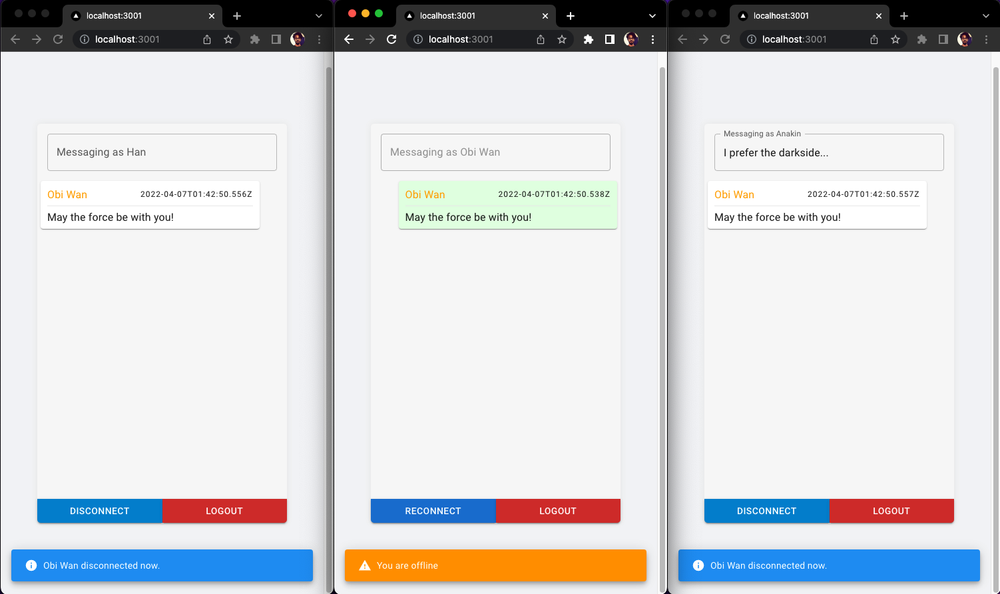
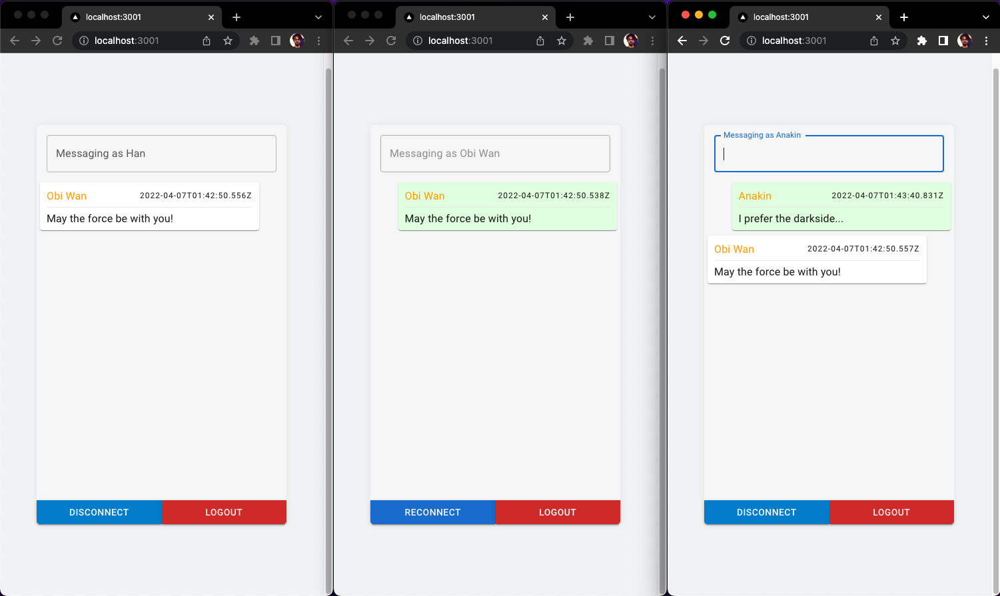
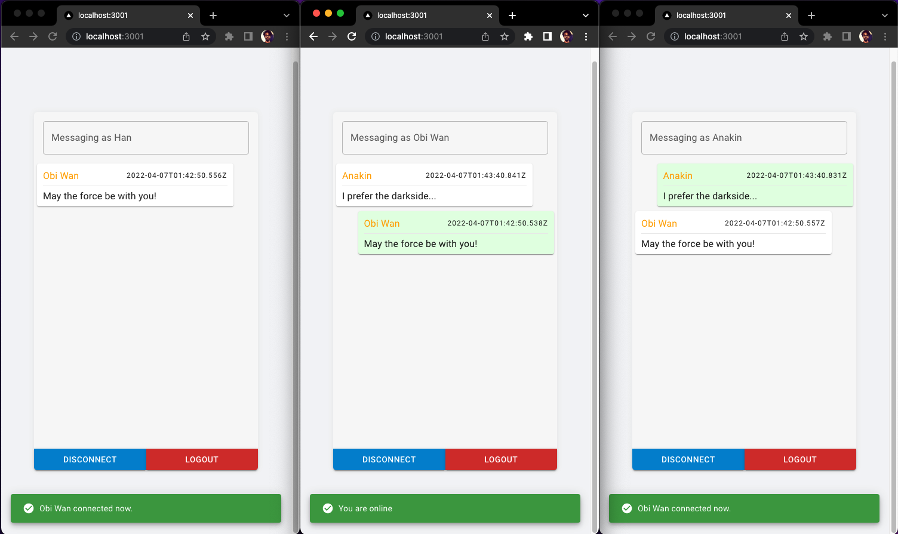

# Socket.io Client for [@erenkurnaz/websocket-example](https://github.com/erenkurnaz/websocket-example)

---

## Description

Nothing fancy here... This repository was created in one go as the interface for the example mentioned in the title. For that reason;

- May contain bugs,
- Best practice may not be followed,
- UI can be ugly

## Installation

> **Please make sure you installed [@erenkurnaz/websocket-example](https://github.com/erenkurnaz/websocket-example) first.**

```bash
# install dependencies
$ yarn

# run the app!
$ yarn dev
```

## Notes

**When you run the API, the following user accounts will be available.**

| User | Email           | Password(_decoded_) | Name   | Surname   | Friends |
| ---- | --------------- | ------------------- | ------ | --------- | ------- |
| #1   | obi@mail.com    | 123456              | Obivan | Kenobi    | #2 - #3 |
| #2   | han@mail.com    | 123456              | Han    | Solo      | #1      |
| #3   | anakin@mail.com | 123456              | Anakin | Skywalker | #1      |

## Screenshots


_Messages are forwarded to friends only._

---


_Connection notifications are sent to friends._

---


_You can also send a message while the friend is offline._

---


_Offline messages are received when the user is online._
